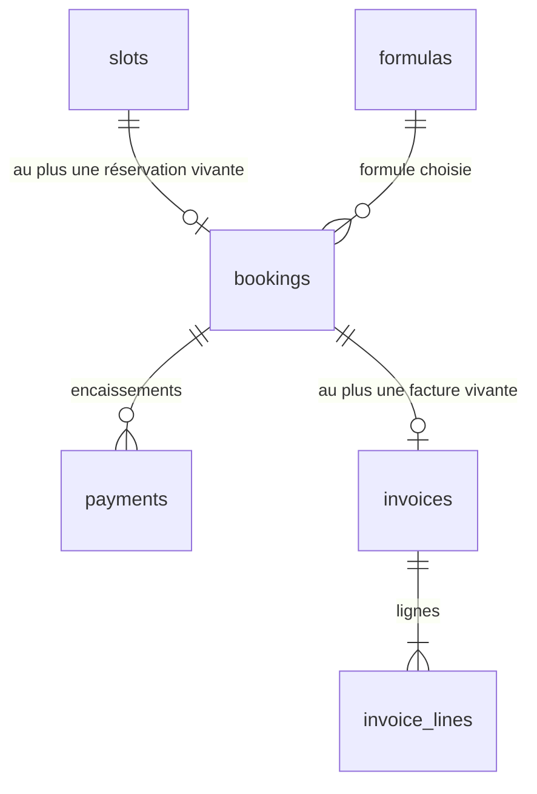
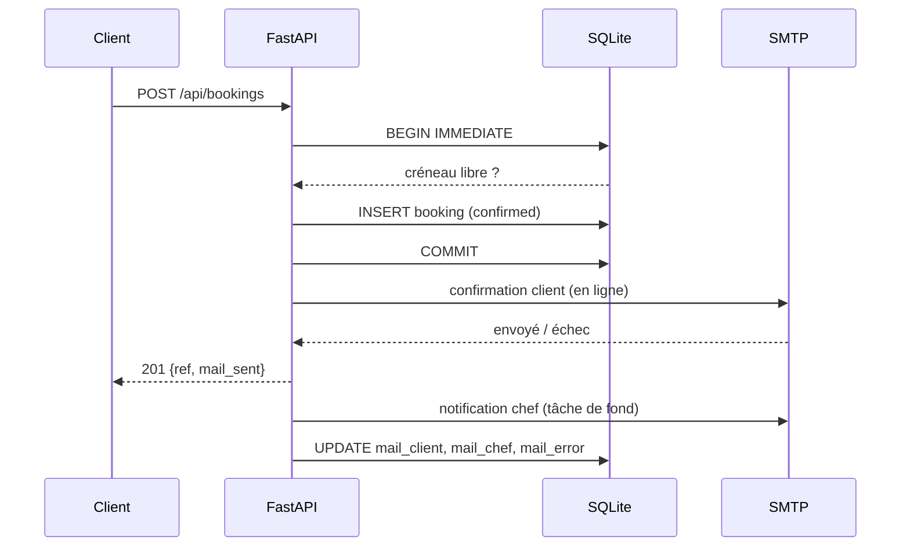
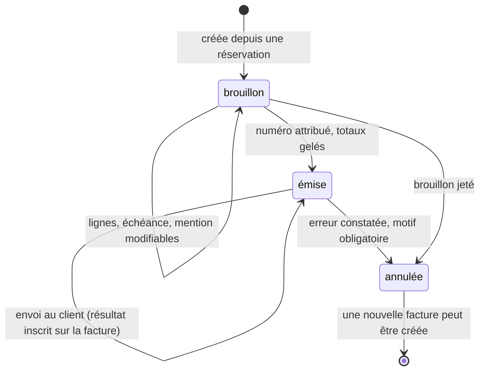
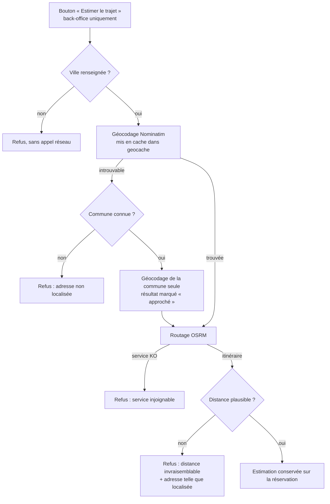

# Architecture

## Vue d'ensemble

```mermaid
flowchart TD
    V[Visiteur] -->|GET /| F[Frontend statique<br/>ES modules, sans build]
    C[Chef] -->|GET /admin| A[Back-office]
    F -->|/api/content, /api/availability, POST /api/bookings| API[FastAPI]
    A -->|/api/admin/* + cookie signé| API
    A -->|/api/admin/invoices/{id}/view| PDF[Facture imprimable]
    API --> DB[(SQLite<br/>volume monté)]
    API -->|smtplib| SMTP[Postfix Dedibox]
    SMTP --> MC[E-mail client]
    SMTP --> MCH[E-mail chef]
    SMTP --> MF[Facture au client<br/>HTML en pièce jointe]
```

Un seul process, une seule image. `backend/main.py` monte `frontend/` en
statique sur `/` après avoir enregistré les routers, donc l'API gagne toujours
sur un fichier de même nom.

## Modèle de données

Dans `backend/schema.sql`.

- **`slots`** — un créneau que le chef accepte de cuisiner : une date + un
  service (`midi` ou `soir`). Contrainte `UNIQUE (date, service)` : ouvrir deux
  fois le même créneau est un no-op, pas un doublon.
- **`bookings`** — une réservation rattachée à un créneau, avec son statut
  (`confirmed` / `cancelled`), sa référence client et l'issue de ses e-mails.
- **`formulas`** — les formules et leurs tarifs, en centimes. Elles ont quitté
  `content/site.json` le jour où elles ont servi de base à une facture :
  « à partir de XX € » est une phrase, pas un prix.
- **`payments`** — les encaissements d'une réservation. Un remboursement y est
  une ligne négative, pour que la somme reste le solde.
- **`invoices` / `invoice_lines`** — une facture et ses lignes.
- **`meta`** — clé/valeur interne, aujourd'hui la version du jeu de
  démonstration et rien d'autre.



L'index partiel `bookings_one_live_per_slot` (unique sur `slot_id` où
`status = 'confirmed'`) est **la** garantie anti-double-réservation. Deux
clients qui valident le dernier créneau en même temps : un seul passe, l'autre
reçoit un 409 et son calendrier est rafraîchi.

## Cycle de vie d'une réservation



La confirmation au client part **avant** la réponse HTTP : la page annonce
« un e-mail vient de vous être envoyé », et cette phrase doit être vraie. La
notification au chef, elle, peut attendre — c'est elle qui part en tâche de
fond, avec l'enregistrement de l'issue des deux envois.

Un échec d'envoi n'annule jamais la réservation : la date est bloquée, le
client voit un message qui le dit, et le back-office affiche l'échec avec un
bouton « Renvoyer les e-mails ».

## Annulation

Seul le chef annule, depuis le back-office. L'annulation passe la réservation
en `cancelled`, ce qui libère mécaniquement le créneau (l'index partiel ne
porte que sur les `confirmed`), et déclenche un e-mail au client.

Fermer un créneau réservé est refusé (409) : la suppression cascaderait sur la
réservation sans prévenir personne. Il faut annuler d'abord.

## Facturation

### Le cycle d'une facture



Une facture émise ne revient **jamais** en brouillon. Son numéro est parti chez
le client ; la modifier produirait deux documents différents sous le même
numéro. `PATCH /api/admin/invoices/{id}` répond 409 sur une facture émise, et
c'est volontaire.

Le numéro est séquentiel par année (`F2026-001`), attribué dans la transaction
d'émission et nulle part ailleurs. Il est calculé par un `MAX` relu à chaque
fois plutôt que par un compteur : un compteur et des factures peuvent
désynchroniser, `MAX` ne le peut pas. L'index unique sur `number` reste le
garde-fou en cas de course.

Annuler consomme le numéro pour de bon — c'est ce qu'exige une séquence sans
trou — et le motif reste attaché à la facture.

### Argent et soldes

Tous les montants sont des **entiers de centimes**, de la base de données au
navigateur. Aucun flottant ne touche un prix.

Ce qui est payé est **la somme des lignes de `payments`**. Il n'existe pas de
colonne « payé » : un état dérivé ne peut pas diverger de ce qu'il résume.

Une créance n'existe qu'à partir d'une **facture émise**. Tant qu'on en est au
brouillon, le back-office affiche une *estimation* tirée de la formule et le
dit — afficher un impayé enverrait le chef relancer un client qui n'a rien
reçu.

### Le rendu

`backend/invoice_html.py` produit une page HTML imprimable, servie par
`/api/admin/invoices/{id}/view` et jointe telle quelle à l'e-mail au client.
Un seul rendu : ce que le chef relit est exactement ce que le client reçoit.
Pas de bibliothèque PDF — la contrainte de dépendances minimales tient, et le
navigateur imprime en PDF.

## Réglages et trajet

`backend/settings.py` garde dans `meta` ce qui est **privé** et que le chef doit
pouvoir changer seul : aujourd'hui son adresse de départ. Elle ne sort jamais
par `/api/content` — le site public n'a aucune raison de savoir d'où part le
chef — et n'apparaît sur aucune facture.

### L'estimation de trajet

`backend/travel.py` interroge **Nominatim** (adresse → coordonnées) puis
**OSRM** (route). Aucune bibliothèque ajoutée : `urllib` suffit. Ce sont des
serveurs publics de démonstration, sans garantie de service, d'où les règles
qui encadrent leur usage ici.



Chacun de ces refus s'inscrit sur la réservation et s'affiche avec son motif :
le chef doit pouvoir distinguer une adresse à corriger d'un service à
réessayer. Aucun de ces chemins n'apparaît jamais sur le parcours d'un client —
un service tiers indisponible ne doit pas pouvoir gêner une réservation.

**Les deux garde-fous ne sont pas de la précaution abstraite, ils viennent d'un
test raté.** « Salle des fêtes », sans ville, a été localisée dans un village à
756 km, et l'application a affiché « 7 h 49 » avec aplomb. Une durée fausse et
crédible est pire que pas de durée du tout. D'où :

1. **Sans code postal ni ville, on ne géocode pas.** Une rue sans ville est
   ambiguë dans toute la France, et le géocodeur tranche au hasard plutôt que
   d'échouer. Le refus est déterministe et précède l'appel réseau.
2. **Au-delà de `TRAVEL_MAX_KM` (150 par défaut), l'estimation est écartée**,
   et le message donne l'adresse *telle qu'elle a été localisée* — le seul
   moyen que le chef voie où le géocodeur s'est trompé.

L'adresse reconnue est d'ailleurs affichée à côté de toute estimation acceptée,
pour la même raison.

### Le repli sur la commune

Une adresse exacte manque souvent au cadastre : lieu-dit, salle des fêtes,
numéro absent. La **commune**, elle, est presque toujours reconnue. Quand
l'adresse échoue mais que le code postal et la ville sont là, l'estimation part
donc du **centre de la commune** et le résultat est marqué `approximate` : le
back-office l'affiche « ≈ 12 min » avec la mention « adresse exacte
introuvable ».

C'est la seule forme d'approximation autorisée ici, et elle ne l'est que parce
qu'elle est annoncée. Une estimation approchée présentée comme telle reste
utile — le chef veut savoir si c'est 15 ou 50 minutes. La même présentée comme
exacte serait un mensonge, ce que le reste de ce module s'emploie à éviter.

Le résultat est conservé sur la réservation : la politique d'usage de ces
services demande de mettre les réponses en cache plutôt que de les redemander,
et une adresse ne bouge pas. Les géocodages le sont aussi, dans `geocache`.

Le lien vers l'application de cartes reste à côté : c'est lui qui donne la
navigation réelle, avec le trafic, et il fonctionne même quand l'estimation a
échoué.

## Jeu de démonstration

`backend/seed.py` remplit une base vide d'exemples qui rendent le back-office
lisible : formules, créneaux, réservations dans tous les états, encaissements,
une facture soldée, une partiellement payée, un brouillon, une annulée puis
réémise.

Trois garde-fous, vérifiés :

1. Il ne touche que les lignes qu'il a créées (`demo = 1`). Le reste part en
   cascade depuis les créneaux, donc il n'y a aucune suppression large à
   écrire.
2. Il s'efface devant le réel : dès qu'une réservation non-démo existe, les
   exemples sont retirés et ne rejouent plus.
3. Il est versionné par un entier global, `SEED_VERSION`. L'incrémenter suffit
   à forcer le rejeu au démarrage suivant.

`SEED_DEMO` l'active (par défaut en `DEV`, éteint ailleurs). Éteindre la
variable retire les exemples au démarrage suivant.

L'identité vendeur imprimée sur les factures de démonstration est fictive et
vit dans `seed.DEMO_LEGAL` : sans elle, chaque facture d'exemple s'imprime avec
les `PLACEHOLDER` du fichier éditorial et ne montre rien.

**Toute évolution fonctionnelle doit se refléter dans le jeu, dans le même
commit, avec `SEED_VERSION` incrémenté.** `tools/check-seed.py` rend la règle
opposable : il sème une base jetable et vérifie que chaque état affichable est
représenté (42 aujourd'hui), nomme ceux qui manquent et sort en 1.

## Frontend

`state → render() → innerHTML`, sans framework.

- `js/state.js` — l'unique objet mutable.
- `js/api.js` — `fetch` + normalisation des erreurs FastAPI en message lisible.
- `js/views/site.js` — la partie éditoriale, rendue une fois au chargement.
- `js/views/booking.js` — liste des dates, choix du service, formulaire,
  confirmation. C'est le seul bloc re-rendu, pour ne pas vider un formulaire
  en cours de saisie.
- `admin/admin.js` — le back-office : onglets, agenda, créneaux, réservations.
- `admin/billing.js` — formules, encaissements, factures. Séparé pour la même
  raison que côté serveur : ouvrir des dates et facturer un repas sont deux
  métiers, et celui-ci manipule de l'argent.

`admin.js` réécrit tout son DOM à chaque rendu. L'éditeur de brouillon relit
donc ses champs dans l'état **avant** chaque re-rendu (`captureDraft`) : sans
cette capture, ajouter une ligne effacerait ce qui vient d'être tapé.

### Pourquoi une liste de dates côté client, un calendrier côté chef

Les deux vues répondent à deux questions différentes. Le visiteur demande
« quand puis-je ? » : il voit donc **la liste des dates ouvertes**, groupées par
mois. Une grille mensuelle où trois cases sur trente sont actives donne
l'impression d'un agenda désert, alors que quatre cartes lisibles donnent envie
de cliquer — et sur téléphone, une carte est une cible bien plus large qu'une
case de calendrier.

Le chef, lui, demande « quelles dates est-ce que j'ouvre ? » : c'est une
question de mois, donc **un calendrier**, avec sélection multiple. Cocher un
week-end entier puis « Ouvrir le dîner » vaut mieux que deux allers-retours par
date. Les jours passés ne sont pas cliquables, et l'ouverture rend compte de ce
qu'elle n'a pas fait (« 4 ouverts, 2 l'étaient déjà ») plutôt que d'absorber la
différence en silence.

`js/util.js` manipule les dates comme des chaînes `YYYY-MM-DD` de bout en
bout : les convertir en `Date` invite un décalage de fuseau qui déplacerait
une réservation d'un jour.
