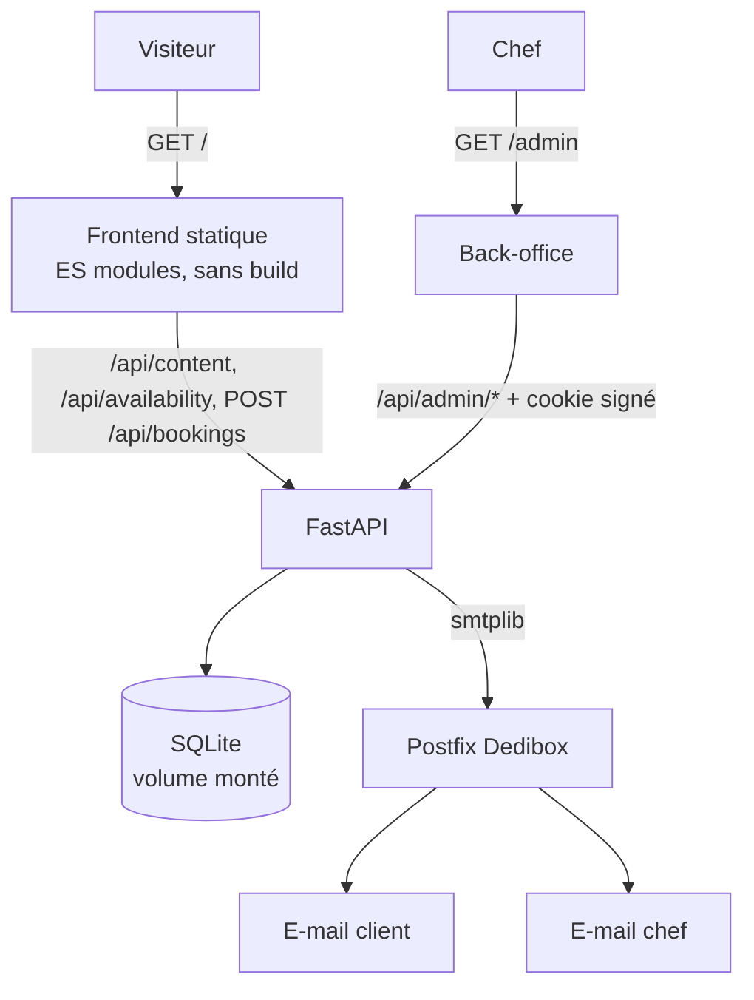
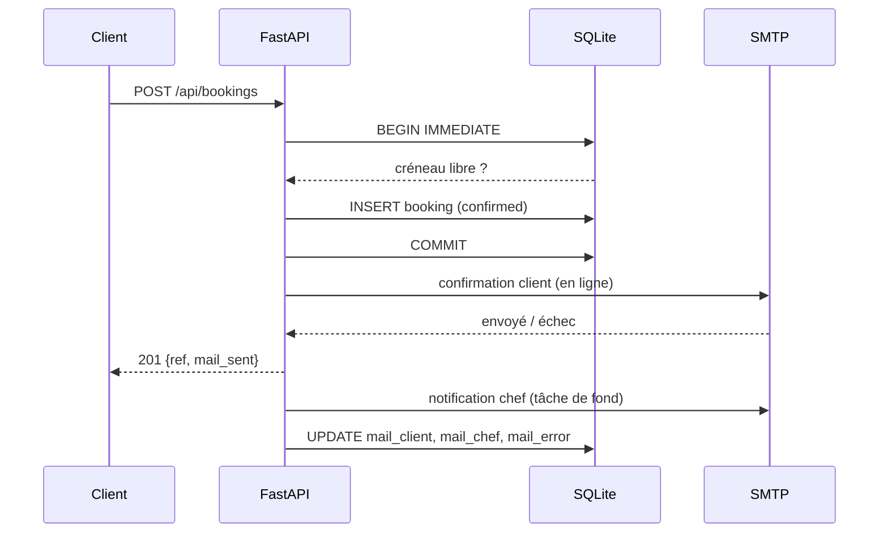

# Architecture

## Vue d'ensemble

Un seul process, une seule image. `backend/main.py` monte `frontend/` en
statique sur `/` après avoir enregistré les routers, donc l'API gagne toujours
sur un fichier de même nom.

## Modèle de données

Deux tables, dans `backend/schema.sql`.

- **`slots`** — un créneau que le chef accepte de cuisiner : une date + un
  service (`midi` ou `soir`). Contrainte `UNIQUE (date, service)` : ouvrir deux
  fois le même créneau est un no-op, pas un doublon.
- **`bookings`** — une réservation rattachée à un créneau, avec son statut
  (`confirmed` / `cancelled`), sa référence client et l'issue de ses e-mails.

L'index partiel `bookings_one_live_per_slot` (unique sur `slot_id` où
`status = 'confirmed'`) est **la** garantie anti-double-réservation. Deux
clients qui valident le dernier créneau en même temps : un seul passe, l'autre
reçoit un 409 et son calendrier est rafraîchi.

## Cycle de vie d'une réservation

La confirmation au client part **avant** la réponse HTTP : la page annonce
« un e-mail vient de vous être envoyé », et cette phrase doit être vraie. La
notification au chef, elle, peut attendre — c'est elle qui part en tâche de
fond, avec l'enregistrement de l'issue des deux envois.

Un échec d'envoi n'annule jamais la réservation : la date est bloquée, le
client voit un message qui le dit, et le back-office affiche l'échec avec un
bouton « Renvoyer les e-mails ».

## Annulation

Seul le chef annule, depuis le back-office. L'annulation passe la réservation
en `cancelled`, ce qui libère mécaniquement le créneau (l'index partiel ne
porte que sur les `confirmed`), et déclenche un e-mail au client.

Fermer un créneau réservé est refusé (409) : la suppression cascaderait sur la
réservation sans prévenir personne. Il faut annuler d'abord.

## Frontend

`state → render() → innerHTML`, sans framework.

- `js/state.js` — l'unique objet mutable.
- `js/api.js` — `fetch` + normalisation des erreurs FastAPI en message lisible.
- `js/views/site.js` — la partie éditoriale, rendue une fois au chargement.
- `js/views/booking.js` — liste des dates, choix du service, formulaire,
  confirmation. C'est le seul bloc re-rendu, pour ne pas vider un formulaire
  en cours de saisie.
- `admin/admin.js` — le back-office, avec son propre état et sa propre page.

### Pourquoi une liste de dates côté client, un calendrier côté chef

Les deux vues répondent à deux questions différentes. Le visiteur demande
« quand puis-je ? » : il voit donc **la liste des dates ouvertes**, groupées par
mois. Une grille mensuelle où trois cases sur trente sont actives donne
l'impression d'un agenda désert, alors que quatre cartes lisibles donnent envie
de cliquer — et sur téléphone, une carte est une cible bien plus large qu'une
case de calendrier.

Le chef, lui, demande « quelles dates est-ce que j'ouvre ? » : c'est une
question de mois, donc **un calendrier**, avec sélection multiple. Cocher un
week-end entier puis « Ouvrir le dîner » vaut mieux que deux allers-retours par
date. Les jours passés ne sont pas cliquables, et l'ouverture rend compte de ce
qu'elle n'a pas fait (« 4 ouverts, 2 l'étaient déjà ») plutôt que d'absorber la
différence en silence.

`js/util.js` manipule les dates comme des chaînes `YYYY-MM-DD` de bout en
bout : les convertir en `Date` invite un décalage de fuseau qui déplacerait
une réservation d'un jour.
