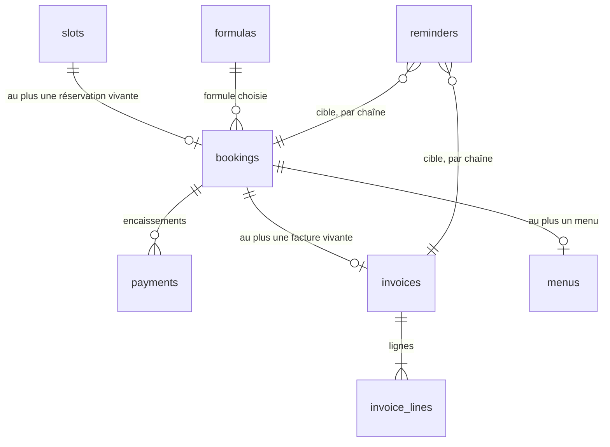
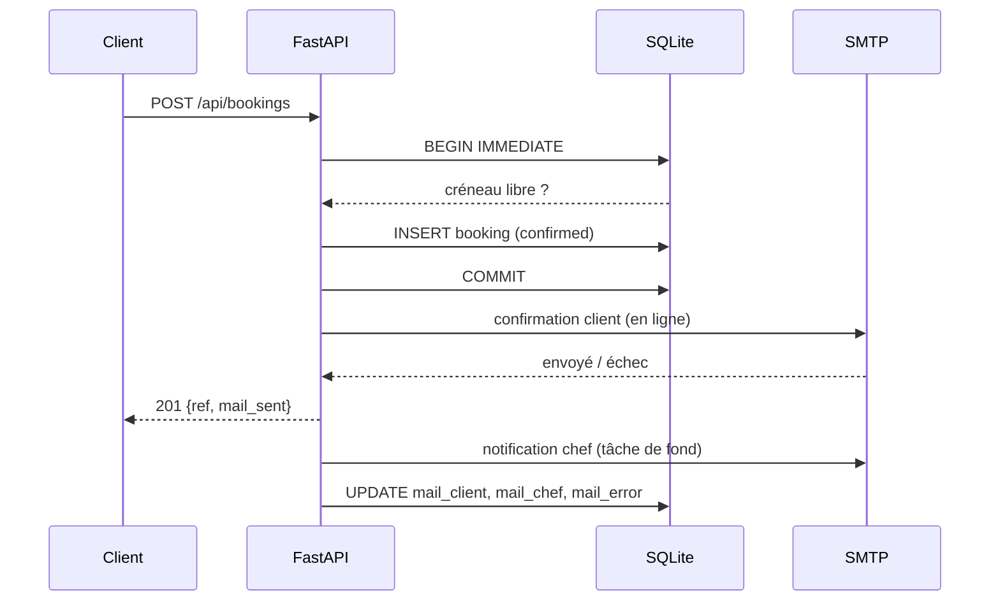
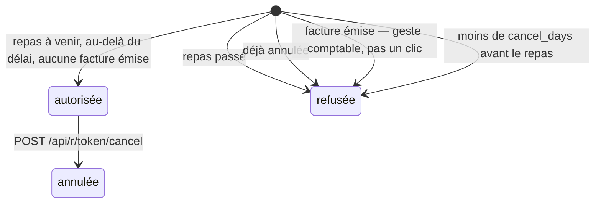
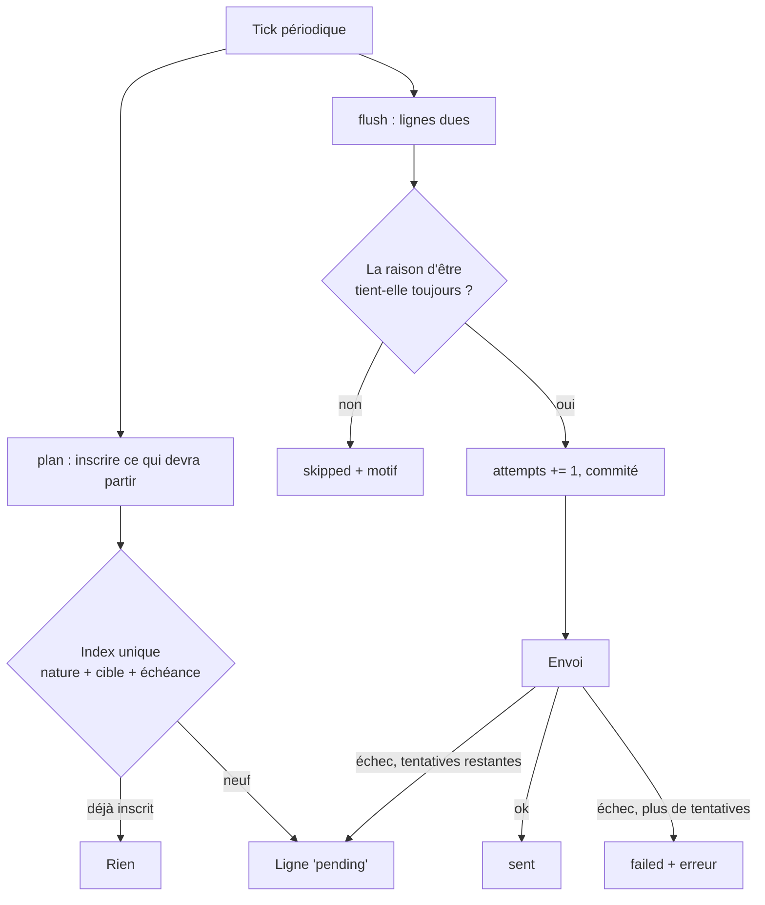
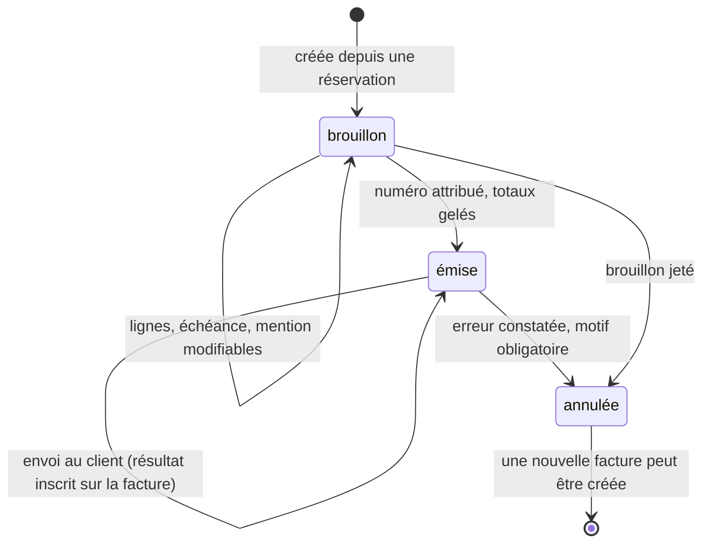
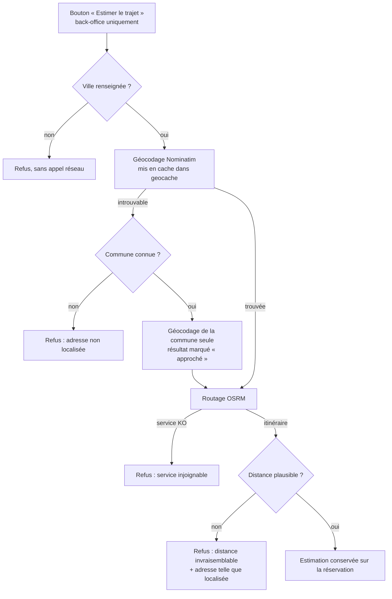

# Architecture

## Vue d'ensemble

```mermaid
flowchart TD
    V[Visiteur] -->|GET /| F[Frontend statique<br/>ES modules, sans build]
    V -->|GET /r/token| CP[Page de suivi<br/>du client]
    C[Chef] -->|GET /admin| A[Back-office]
    F -->|/api/content, /api/availability<br/>POST /api/bookings, POST /api/quotes| API[FastAPI]
    CP -->|/api/r/token| API
    A -->|/api/admin/* + cookie signé| API
    A -->|/api/admin/invoices/{id}/view| PDF[Facture imprimable]
    A -->|/api/admin/accounting/*.csv| CSV[Export comptable]
    API --> DB[(SQLite<br/>volume monté)]
    L[Boucle de rappels<br/>même process, tick périodique] --> DB
    L -->|smtplib| SMTP
    API -->|smtplib| SMTP[Postfix Dedibox]
    SMTP --> MC[E-mails client<br/>confirmation, menu, rappel, facture]
    SMTP --> MCH[E-mails chef<br/>réservation, devis, à facturer]
```

Un seul process, une seule image. `backend/main.py` monte `frontend/` en
statique sur `/` après avoir enregistré les routers, donc l'API gagne toujours
sur un fichier de même nom.

## Modèle de données

Dans `backend/schema.sql`.

- **`slots`** — un créneau que le chef accepte de cuisiner : une date + un
  service (`midi` ou `soir`). Contrainte `UNIQUE (date, service)` : ouvrir deux
  fois le même créneau est un no-op, pas un doublon.
- **`bookings`** — une réservation rattachée à un créneau, avec son statut
  (`confirmed` / `cancelled`), sa référence client et l'issue de ses e-mails.
- **`formulas`** — les formules et leurs tarifs, en centimes. Elles ont quitté
  `content/site.json` le jour où elles ont servi de base à une facture :
  « à partir de XX € » est une phrase, pas un prix.
- **`payments`** — les encaissements d'une réservation. Un remboursement y est
  une ligne négative, pour que la somme reste le solde.
- **`invoices` / `invoice_lines`** — une facture et ses lignes.
- **`menus`** — le menu composé pour un repas : ce qui sera dans l'assiette,
  par opposition à la formule qui n'est qu'un cadre et un tarif. Au plus un par
  réservation.
- **`quotes`** — les demandes de devis. Ce ne sont **pas** des réservations :
  elles ne prennent aucun créneau et n'ont donc aucun index d'unicité à
  défendre.
- **`reminders`** — la file des rappels et relances : une ligne = un envoi
  prévu, à une date, pour une cible.
- **`meta`** — clé/valeur interne : la version du jeu de démonstration et les
  réglages du chef (`setting:*`).



`quotes` ne figure pas sur ce schéma : une demande de devis ne se rattache à
rien. C'est précisément ce qui la distingue d'une réservation.

`reminders.target` est une **chaîne** (`booking:12`, `invoice:7`) et non deux
colonnes nullables : en SQLite deux `NULL` sont distincts, donc un index unique
portant sur une colonne vide ne dédoublonnerait rien — et c'est cet index qui
porte tout le « une seule fois ».

L'index partiel `bookings_one_live_per_slot` (unique sur `slot_id` où
`status = 'confirmed'`) est **la** garantie anti-double-réservation. Deux
clients qui valident le dernier créneau en même temps : un seul passe, l'autre
reçoit un 409 et son calendrier est rafraîchi.

## Cycle de vie d'une réservation



La confirmation au client part **avant** la réponse HTTP : la page annonce
« un e-mail vient de vous être envoyé », et cette phrase doit être vraie. La
notification au chef, elle, peut attendre — c'est elle qui part en tâche de
fond, avec l'enregistrement de l'issue des deux envois.

Un échec d'envoi n'annule jamais la réservation : la date est bloquée, le
client voit un message qui le dit, et le back-office affiche l'échec avec un
bouton « Renvoyer les e-mails ».

## Régimes et allergies

`backend/diets.py` porte un **catalogue fermé**, servi au front par
`/api/content` pour que le formulaire, le back-office et les e-mails nomment
les mêmes choses. Deux décisions le structurent :

- **Un régime porte un nombre de convives**, pas un booléen. Le chef ne
  cuisine pas « des végétariens », il cuisine deux assiettes. Le nombre est
  borné au nombre de convives.
- **Le drapeau `allergy` sépare partout** : une préférence contrariée déçoit,
  une allergie manquée envoie quelqu'un à l'hôpital. Badge rouge contre badge
  neutre, allergies en tête du formulaire, « ⚠ allergie » dans le sujet de
  l'e-mail au chef, tuile dédiée dans le résumé du back-office.

Le bloc « Régimes » des e-mails est écrit **même vide** : un bloc qui
disparaît faute de contenu ne se distingue pas d'un bloc oublié. Un
identifiant inconnu est refusé (formulaire trafiqué ou catalogue
désynchronisé) ; un identifiant retiré du catalogue garde son identifiant comme
libellé, parce qu'un intitulé moche vaut mieux qu'une contrainte escamotée.

Le champ libre `message` reste : il dit ce qu'un catalogue fermé ne dira jamais.

## Zone de déplacement

Le contrôle se fait sur le **code postal**, pas sur une distance calculée
(`settings.in_area`). Un géocodage sur le chemin d'une réservation ajouterait
un appel réseau à un service public sans garantie — sa latence, ses pannes — au
moment précis où le client valide, et un service lent ferait échouer des
réservations légitimes. Le préfixe est instantané et hors ligne.

La phrase affichée au client est **dérivée** de la liste qui fait loi
(`settings.area_note`), jamais recopiée dans le fichier éditorial : deux
endroits à tenir à jour, c'est une zone annoncée qui diverge de la zone
appliquée. Deux cas passent toujours : aucune zone configurée (le défaut), et
aucun code postal lisible — l'adresse est facultative, et refuser faute de code
postal la rendrait obligatoire par un chemin que personne n'a choisi.

Un refus renvoie vers le devis : c'est exactement la conversation « c'est loin,
mais peut-être jouable ».

## La page de suivi du client

`GET /r/{token}` sert une page qui ne contient aucune donnée : elle interroge
`/api/r/{token}`, qui lui refuse ou lui répond.

**Le jeton, pas la référence.** `ref` est faite pour être dictée au téléphone —
six caractères, alphabet sans sosies — donc devinable. Chaque réservation porte
un `token` séparé de 128 bits, qui n'apparaît que dans le lien envoyé au
client. La page porte `noindex` et `referrer: no-referrer`.

Le client y voit son repas, ses régimes, son menu (une fois envoyé), sa facture
si elle est émise, et peut annuler lui-même.



**Le serveur décide seul.** Le bouton n'est qu'un affichage : `POST /cancel`
refait le contrôle dans la transaction qui écrit. Un onglet laissé ouvert trois
jours ne doit pas pouvoir annuler passé le délai parce que lui croit encore que
c'est permis. Le motif est renvoyé **même quand c'est autorisé**, pour que le
client lise jusqu'à quand il peut le faire.

L'annulation ne rembourse rien : elle prévient. L'e-mail au chef porte le
montant encaissé en toutes lettres, « rien à rembourser » aussi clairement que
le contraire.

## Menus

`backend/menus.py`. Une formule est un cadre et un tarif ; le **menu** est ce
qui sera dans l'assiette ce soir-là, composé après avoir parlé au client.

- **Un menu appartient à une réservation, une seule.** Recyclé d'un client à
  l'autre, ce serait un catalogue — et le chef le composerait ailleurs.
- **Brouillon, puis envoyé.** Brouillon, il n'existe que pour le chef : ni la
  page du client ni le rappel avant repas ne le laissent fuiter. Le modifier
  après envoi le **repose en brouillon** et le retire de la page du client —
  sinon le chef croirait son client au courant d'un menu qu'il n'a jamais vu.
- **Les services sont libres.** « Entrée / Plat / Dessert » est une suggestion
  dans une `datalist`, pas un schéma : un plat unique en cocotte et un menu à
  sept services vivent dans la même colonne.

Un menu vide ne part pas : un e-mail intitulé « votre menu » sans un seul plat
inquiète plus qu'il ne renseigne.

## Demandes de devis

Le calendrier ne montre que les créneaux déjà ouverts. Une date non ouverte, un
mariage, un buffet pour quarante : rien n'avait de chemin. `POST /api/quotes`
en ouvre un.

**Ce n'est pas une réservation**, et tout en découle : aucun créneau pris,
aucune date bloquée. Le formulaire exige beaucoup moins — nom et e-mail
suffisent — parce que chaque champ obligatoire de plus est une demande qui
n'arrive pas. Une date illisible est blanchie plutôt que refusée. L'accusé de
réception dit noir sur blanc qu'aucune date n'est bloquée : un accusé qui
ressemble à une confirmation fait attendre un chef qui ne viendra pas.

Côté back-office, **aucune transition n'est automatique** : la réponse part de
la boîte mail du chef, pas d'ici, et deviner où en est l'échange le ferait
mentir. Quand la demande porte une date *et* un service, un bouton ouvre le
créneau — **ouvert, pas réservé** : le client confirme depuis le site, ce qui
lui fait relire la date et lui envoie sa vraie confirmation.

## Rappels et relances

`backend/reminders.py`. `invoices.due_on` était saisi, imprimé, et lu par
personne. Trois natures comblent les trois trous : rappel au client avant le
repas, relance d'impayé, signal au chef sur un repas servi non facturé.

La boucle tourne **dans le processus** (`main.lifespan`), pas dans un cron : un
seul conteneur, une seule base, rien de plus à installer. Le tour est synchrone
— SQLite et SMTP le sont — donc il part dans un thread : un serveur SMTP lent
gèlerait sinon toutes les requêtes HTTP pendant son délai d'attente.



**Deux temps séparés, et c'est tout le dessin.** Le « une seule fois » est
porté par l'index unique et par rien d'autre : replanifier cent fois n'ajoute
rien, et deux relances d'une même facture n'existent qu'en portant deux
échéances différentes.

**Chaque envoi revérifie sa propre raison d'être** juste avant de partir : une
réservation annulée ne reçoit pas son rappel, une facture soldée hier ne reçoit
pas sa relance. Sans ce contrôle, la file enverrait des vérités périmées — et
relancer un client qui a déjà payé coûte plus cher que de se taire.

**Un rappel manqué est pire qu'un rappel en double.** Le compteur de tentatives
monte et est commité *avant* l'envoi : si le processus meurt entre le `250` du
serveur SMTP et l'écriture du résultat, la relance repart une fois. Compromis
assumé, borné à `REMINDER_MAX_ATTEMPTS`, après quoi la ligne s'arrête sur
`failed` et attend un geste humain plutôt que de marteler une adresse qui
refuse.

La relance d'impayé porte le **solde restant**, pas le total : relancer sur le
total un client qui a versé un acompte lui donne raison de discuter au lieu de
payer.

Rien n'est silencieux : `REMINDERS_ENABLED=0` est journalisé en warning au
démarrage, `/health` publie les compteurs par état, et l'onglet Relances montre
la file entière — en **consultation seule**, parce que la réécrire à la main la
rendrait inutile comme preuve de ce qui est parti.

## Comptabilité

`backend/accounting.py`. **La base déclarable, ce sont les encaissements, pas
les factures.** Le régime micro est une comptabilité de trésorerie : on déclare
ce qui est entré sur le compte pendant le trimestre. Une facture émise en mars
et payée en avril appartient au deuxième trimestre. Tout part donc de
`payments.received_on` et jamais de `invoices.issued_on` ; les deux vues sont
montrées côte à côte, mais l'encaissé est nommé et placé en premier — un
tableau qui mettrait le facturé en tête inviterait à déclarer un montant faux.

Un remboursement est une ligne négative : il se retranche du trimestre où il a
lieu, ce que veut une comptabilité de caisse. Un encaissement dont la date est
illisible n'est pas noyé dans un trimestre au hasard : il est compté à part et
affiché en rouge.

L'export CSV a trois détails qui décident s'il est utilisable :

1. **Point-virgule** — en locale française la virgule est le séparateur
   décimal ; avec une virgule, tout le fichier tient dans une colonne.
2. **BOM UTF-8** — sans lui, Excel lit l'UTF-8 comme du latin-1 et les noms
   accentués ressortent en mojibake.
3. **Neutralisation des formules** — une cellule commençant par `=`, `+`, `-`
   ou `@` est exécutée à l'ouverture. Le contenu vient d'un formulaire public :
   aucune raison de faire confiance à un nom saisi par un inconnu. Un montant
   négatif garde son signe ; un libellé est préfixé d'une apostrophe.

## Annulation par le chef

Le chef annule depuis le back-office, sans condition de délai — c'est lui qui
décide, et un contretemps n'attend pas. L'annulation passe la réservation en
`cancelled`, ce qui libère mécaniquement le créneau (l'index partiel ne porte
que sur les `confirmed`), et déclenche un e-mail au client.

Fermer un créneau réservé est refusé (409) : la suppression cascaderait sur la
réservation sans prévenir personne. Il faut annuler d'abord.

## Facturation

### Le cycle d'une facture



Une facture émise ne revient **jamais** en brouillon. Son numéro est parti chez
le client ; la modifier produirait deux documents différents sous le même
numéro. `PATCH /api/admin/invoices/{id}` répond 409 sur une facture émise, et
c'est volontaire.

Le numéro est séquentiel par année (`F2026-001`), attribué dans la transaction
d'émission et nulle part ailleurs. Il est calculé par un `MAX` relu à chaque
fois plutôt que par un compteur : un compteur et des factures peuvent
désynchroniser, `MAX` ne le peut pas. L'index unique sur `number` reste le
garde-fou en cas de course.

Annuler consomme le numéro pour de bon — c'est ce qu'exige une séquence sans
trou — et le motif reste attaché à la facture.

### Argent et soldes

Tous les montants sont des **entiers de centimes**, de la base de données au
navigateur. Aucun flottant ne touche un prix.

Ce qui est payé est **la somme des lignes de `payments`**. Il n'existe pas de
colonne « payé » : un état dérivé ne peut pas diverger de ce qu'il résume.

Une créance n'existe qu'à partir d'une **facture émise**. Tant qu'on en est au
brouillon, le back-office affiche une *estimation* tirée de la formule et le
dit — afficher un impayé enverrait le chef relancer un client qui n'a rien
reçu.

### Le rendu

`backend/invoice_html.py` produit une page HTML imprimable, servie par
`/api/admin/invoices/{id}/view` et jointe telle quelle à l'e-mail au client.
Un seul rendu : ce que le chef relit est exactement ce que le client reçoit.
Pas de bibliothèque PDF — la contrainte de dépendances minimales tient, et le
navigateur imprime en PDF.

## Réglages et trajet

`backend/settings.py` garde dans `meta` ce qui est **privé** et que le chef doit
pouvoir changer seul : aujourd'hui son adresse de départ. Elle ne sort jamais
par `/api/content` — le site public n'a aucune raison de savoir d'où part le
chef — et n'apparaît sur aucune facture.

### L'estimation de trajet

`backend/travel.py` interroge **Nominatim** (adresse → coordonnées) puis
**OSRM** (route). Aucune bibliothèque ajoutée : `urllib` suffit. Ce sont des
serveurs publics de démonstration, sans garantie de service, d'où les règles
qui encadrent leur usage ici.



Chacun de ces refus s'inscrit sur la réservation et s'affiche avec son motif :
le chef doit pouvoir distinguer une adresse à corriger d'un service à
réessayer. Aucun de ces chemins n'apparaît jamais sur le parcours d'un client —
un service tiers indisponible ne doit pas pouvoir gêner une réservation.

**Les deux garde-fous ne sont pas de la précaution abstraite, ils viennent d'un
test raté.** « Salle des fêtes », sans ville, a été localisée dans un village à
756 km, et l'application a affiché « 7 h 49 » avec aplomb. Une durée fausse et
crédible est pire que pas de durée du tout. D'où :

1. **Sans code postal ni ville, on ne géocode pas.** Une rue sans ville est
   ambiguë dans toute la France, et le géocodeur tranche au hasard plutôt que
   d'échouer. Le refus est déterministe et précède l'appel réseau.
2. **Au-delà de `TRAVEL_MAX_KM` (150 par défaut), l'estimation est écartée**,
   et le message donne l'adresse *telle qu'elle a été localisée* — le seul
   moyen que le chef voie où le géocodeur s'est trompé.

L'adresse reconnue est d'ailleurs affichée à côté de toute estimation acceptée,
pour la même raison.

### Le repli sur la commune

Une adresse exacte manque souvent au cadastre : lieu-dit, salle des fêtes,
numéro absent. La **commune**, elle, est presque toujours reconnue. Quand
l'adresse échoue mais que le code postal et la ville sont là, l'estimation part
donc du **centre de la commune** et le résultat est marqué `approximate` : le
back-office l'affiche « ≈ 12 min » avec la mention « adresse exacte
introuvable ».

C'est la seule forme d'approximation autorisée ici, et elle ne l'est que parce
qu'elle est annoncée. Une estimation approchée présentée comme telle reste
utile — le chef veut savoir si c'est 15 ou 50 minutes. La même présentée comme
exacte serait un mensonge, ce que le reste de ce module s'emploie à éviter.

Le résultat est conservé sur la réservation : la politique d'usage de ces
services demande de mettre les réponses en cache plutôt que de les redemander,
et une adresse ne bouge pas. Les géocodages le sont aussi, dans `geocache`.

Le lien vers l'application de cartes reste à côté : c'est lui qui donne la
navigation réelle, avec le trafic, et il fonctionne même quand l'estimation a
échoué.

## Jeu de démonstration

`backend/seed.py` remplit une base vide d'exemples qui rendent le back-office
lisible : formules, créneaux, réservations dans tous les états, encaissements,
une facture soldée, une partiellement payée, un brouillon, une annulée puis
réémise.

Trois garde-fous, vérifiés :

1. Il ne touche que les lignes qu'il a créées (`demo = 1`). Le reste part en
   cascade depuis les créneaux, donc il n'y a aucune suppression large à
   écrire.
2. Il s'efface devant le réel : dès qu'une réservation non-démo existe, les
   exemples sont retirés et ne rejouent plus.
3. Il est versionné par un entier global, `SEED_VERSION`. L'incrémenter suffit
   à forcer le rejeu au démarrage suivant.

`SEED_DEMO` l'active (par défaut en `DEV`, éteint ailleurs). Éteindre la
variable retire les exemples au démarrage suivant.

L'identité vendeur imprimée sur les factures de démonstration est fictive et
vit dans `seed.DEMO_LEGAL` : sans elle, chaque facture d'exemple s'imprime avec
les `PLACEHOLDER` du fichier éditorial et ne montre rien.

**Toute évolution fonctionnelle doit se refléter dans le jeu, dans le même
commit, avec `SEED_VERSION` incrémenté.** `tools/check-seed.py` rend la règle
opposable : il sème une base jetable et vérifie que chaque état affichable est
représenté (125 aujourd'hui), nomme ceux qui manquent et sort en 1.

Deux contrôles ne portent pas sur le semis mais sur du code que le semis ne
rencontrerait jamais : les réglages relus quand une seule valeur est
enregistrée (une régression réelle — un import local dans une branche, utilisé
par la suivante, qui mettait le site public entier en 500), et la
correspondance entre le modèle du formulaire de réglages et `settings.DEFAULTS`
(un champ qui s'affiche, s'enregistre en apparence et ne fait rien). Ils sont
là parce qu'un jeu de démonstration part toujours de valeurs vides.

## Frontend

`state → render() → innerHTML`, sans framework.

- `js/state.js` — l'unique objet mutable.
- `js/api.js` — `fetch` + normalisation des erreurs FastAPI en message lisible.
- `js/views/site.js` — la partie éditoriale, rendue une fois au chargement.
- `js/views/booking.js` — liste des dates, choix du service, formulaire,
  régimes, confirmation. C'est un des deux seuls blocs re-rendus, pour ne pas
  vider un formulaire en cours de saisie.
- `js/views/quote.js` — la demande de devis, sur la même page, avec son propre
  état : une saisie commencée dans l'un ne doit jamais se retrouver dans
  l'autre.
- `client/client.js` — la page de suivi du client. Elle ne décide rien : ce
  qu'elle affiche et ce qu'elle propose viennent de l'API.
- `admin/admin.js` — le back-office : onglets, agenda, créneaux, réservations.
- `admin/billing.js` — formules, encaissements, factures, menus, devis,
  relances, comptabilité. Séparé pour la même raison que côté serveur : ouvrir
  des dates et facturer un repas sont deux métiers, et celui-ci manipule de
  l'argent.

`admin.js` réécrit tout son DOM à chaque rendu. L'éditeur de brouillon et
l'éditeur de menu relisent donc leurs champs dans l'état **avant** chaque
re-rendu (`captureDraft`, `captureMenu`) : sans cette capture, ajouter une
ligne effacerait ce qui vient d'être tapé.

Le même piège existe côté public sur les régimes. Trois détails le désamorcent,
et chacun corrige un comportement observé :

1. La case est écoutée sur `change`, pas sur `click` — un clic sur le libellé
   produit aussi un clic synthétique sur la case, et le régime se cochait puis
   se décochait.
2. Le compteur est **hors** du `<label>` : un champ interactif imbriqué dans un
   label dont le contrôle est la case fait retomber le clic sur la case selon
   les navigateurs, donc décocher en voulant corriger un nombre.
3. Le compteur se met à jour **sans re-rendu** : réécrire le formulaire à
   chaque frappe ferait perdre le focus au milieu de la saisie.

### Pourquoi une liste de dates côté client, un calendrier côté chef

Les deux vues répondent à deux questions différentes. Le visiteur demande
« quand puis-je ? » : il voit donc **la liste des dates ouvertes**, groupées par
mois. Une grille mensuelle où trois cases sur trente sont actives donne
l'impression d'un agenda désert, alors que quatre cartes lisibles donnent envie
de cliquer — et sur téléphone, une carte est une cible bien plus large qu'une
case de calendrier.

Le chef, lui, demande « quelles dates est-ce que j'ouvre ? » : c'est une
question de mois, donc **un calendrier**, avec sélection multiple. Cocher un
week-end entier puis « Ouvrir le dîner » vaut mieux que deux allers-retours par
date. Les jours passés ne sont pas cliquables, et l'ouverture rend compte de ce
qu'elle n'a pas fait (« 4 ouverts, 2 l'étaient déjà ») plutôt que d'absorber la
différence en silence.

`js/util.js` manipule les dates comme des chaînes `YYYY-MM-DD` de bout en
bout : les convertir en `Date` invite un décalage de fuseau qui déplacerait
une réservation d'un jour.
